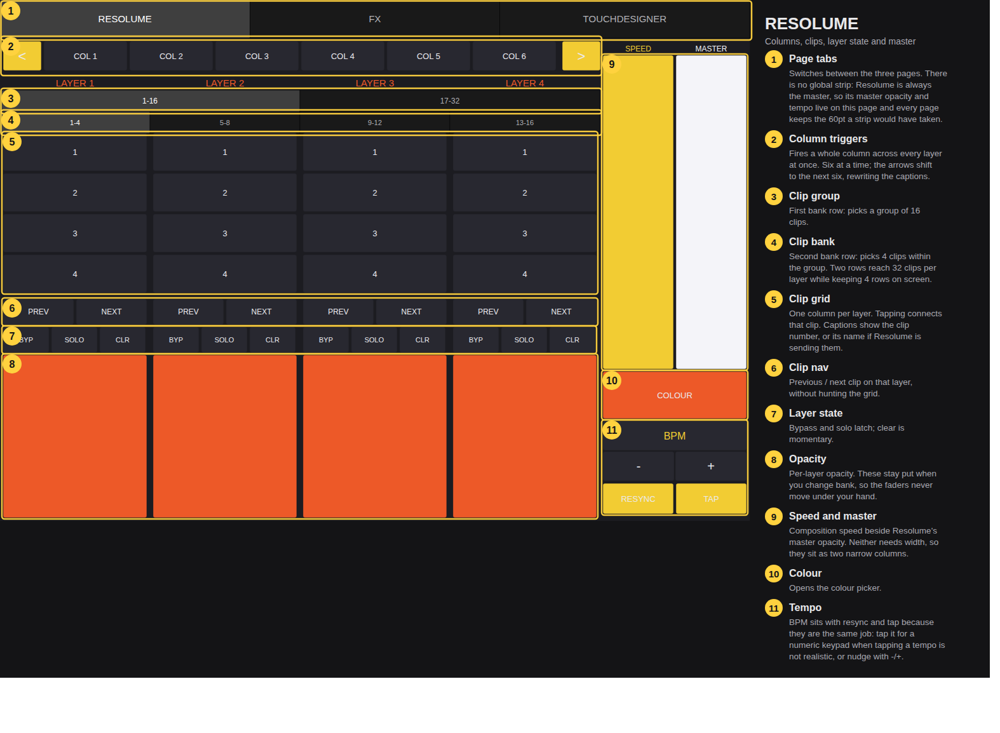
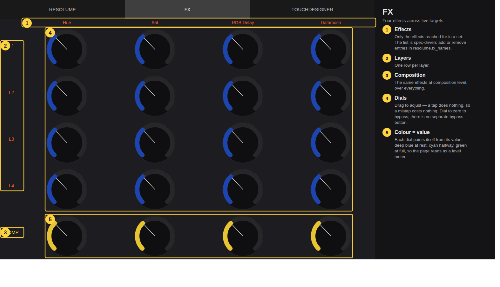
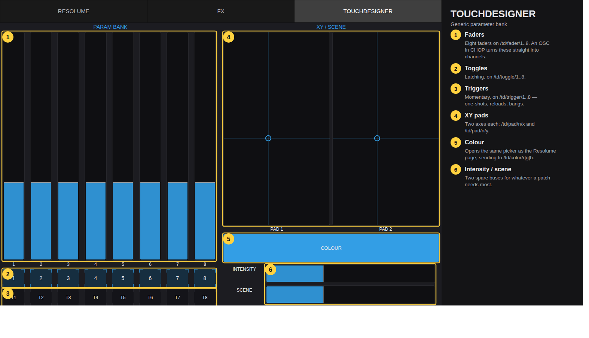

# PlanB-FX — TouchOSC surface for Resolume Arena + TouchDesigner

A custom TouchOSC control surface that drives **Resolume Arena** and
**TouchDesigner** from one iPad, with a tab bar to switch between views. Built
for an iPad Air (4th gen), in both portrait and landscape.

Everything in the layout is generated from one spec file. Change
`spec/mapping.yaml`, run `make`, copy the `.tosc` to the tablet.

```sh
make            # build both layouts, regenerate the address map, verify
```

---

## The pages

### RESOLUME



Columns, clips and layer state. The top row fires **whole columns** across
every layer at once: six at a time, with `<` and `>` to reach the rest
(`columns_total` in the spec, 32 by default). Which column a button fires
depends on the offset the arrows set, so those buttons carry no fixed address —
the row keeps the offset, rewrites the captions and sends with `sendOSC`. Below it, TouchOSC has no scrolling control, so clips are
reached by **banking** over two rows of tabs — the first picks a group of 16,
the second a bank of 4 — which reaches 32 clips per layer while keeping only 4
rows on screen. The space that saves goes to the opacity faders.

**There is no global strip.** Resolume is always the master, so its master
opacity sits here as a narrow column beside composition speed — neither needs
width, and they are coloured differently so neither gets grabbed by mistake — and BPM, resync and tap are grouped at the bottom because they are the
same job. Removing the strip gives every page back the 60pt it was taking.

Banking moves every layer at once, and **only the clip buttons move**: the
PREV/NEXT row, bypass/solo/clear and the faders stay put, so nothing shifts
under your hand mid-set.

`bank_groups: 3` in the spec reaches 48 clips per layer with no layout change.

### FX



Layers down, effects across, one dial per cell and nothing else — **dialling to
zero is the bypass**, so the whole cell belongs to the dial (119pt in
landscape, 171pt in portrait).

The effect list is deliberately short: only what gets reached for in a set.
Adding one back is two lines in `resolume.fx_names` plus `grid.fx_params`.

Three things make a mistap harmless here, which matters in the dark:

| | |
| --- | --- |
| **Large dials** | Four effects, and no bypass button sharing the cell. |
| **Wide gutters** | A finger that lands off-target hits dead space, not the next effect. |
| **Drag-only** | Relative response: a tap does *nothing*. The value moves only while dragging, instead of jumping to wherever the finger landed. |

Each dial also paints itself from its value — deep blue at rest, cyan halfway,
green at full — so the page reads as a level meter at a glance. The three
stops are `fx_scale` in the spec.

### TOUCHDESIGNER



A generic parameter bank on flat, predictable addresses, so an `OSC In CHOP`
turns every control straight into a channel (`td/fader/1`, `td/pad/1/x`, …).
`touchdesigner/osc_router.py` is the other route: an `OSC In DAT` callback that
drives named parameters, with ranges you set per address.

---

## Transport

OSC to both hosts on separate connections. The slot numbers are baked into the
layout, so if you reorder them in the app, change the spec and rebuild rather
than re-mapping by hand.

| Slot | Target | Port | Drives |
| --- | --- | --- | --- |
| 1 | Resolume Arena | 7000 | RESOLUME and FX pages, columns, master, tempo, colour |
| 2 | TouchDesigner | 7001 | TOUCHDESIGNER page |

---

## Orientation

A TouchOSC document has **one fixed size and orientation**, and the app's AUTO
rotation only rotates the rendered surface — it does not rearrange controls. A
single layout therefore cannot reflow when the tablet is turned. This was
tested rather than assumed: `tools/build_probe.py` builds a layout whose script
prints the root frame and a resize counter, and on the iPad Air 4 with Rotation
set to AUTO, **neither changes when the device is rotated**. TouchOSC does not
report rotation to scripts.

So both orientations are generated from the same spec, sized to the iPad Air
4's 1180x820 points so neither letterboxes:

* `build/vj-control-landscape.tosc` — 1180x820
* `build/vj-control-portrait.tosc` — 820x1180

The pages rearrange to suit the aspect ratio. Every OSC address is identical in
both, so the files are interchangeable mid-set: load the other one and carry
on, with nothing to change on either host. Keep Rotation on **NORTH**, or AUTO
will fight the two-file approach.

---

## Things worth knowing

**The colour picker** is the swatches variant of the ColorPicker module from
[tshoppa/touchOSC](https://github.com/tshoppa/touchOSC), vendored in `vendor/`
and grafted in at build time. A COLOUR swatch on the Resolume and TouchDesigner
pages opens it. It notifies its caller continuously as the colour is dragged,
so the change is live rather than on confirm. The picked colour is written into
three hidden R/G/B faders, and *those* carry the OSC: the component sends
nothing itself, and a fader holds the value as well as sending it. Scripts can
send directly with `sendOSC` — the column row does — but then nothing holds the
current colour.

**The BPM field** takes a typed number: tap it for a numeric keypad
(`Builder.num_pad`), or nudge with -/+. Tapping a tempo is not always
realistic. It sits directly above RESYNC and TAP.

**Names on the clip buttons** will appear if Resolume publishes them: the
labels carry receive-only messages that write an incoming string into their
caption. Requires OSC Output enabled in Arena and pointed at the iPad. Until
then the buttons show clip numbers.

**Dragging off a control** does not hand the gesture to its neighbour. Every
continuous control sets `grabFocus`, applied by the writer rather than per page
so nothing added later can be forgotten. Buttons deliberately do not — sliding
off a button before lifting is how you abort a mis-press.

---

## Addresses that still need confirming

Written from Resolume's naming conventions and **not yet verified against a
running composition**. Each fails quietly — a wrong address costs the feature,
not the surface. In Arena, *Shortcuts > Edit OSC*, click the control, and put
the address it reports into the spec.

| What | Current guess | If wrong |
| --- | --- | --- |
| FX effects and parameters | `huerotate/rotation`, `saturation/saturation`, `rgbdelay/delay`, `datamosh/amount` | Dials do nothing |
| Clip next / previous | `.../connectnextclip`, `.../connectpreviousclip` | Buttons do nothing |
| Column triggers | `/composition/columns/{n}/connect` | COL row does nothing |
| Colour | Solid Colour effect's `color/red`, `/green`, `/blue` | Picker does nothing |
| Tempo | `/composition/tempocontroller/tempo`, sent normalised across 20-500 BPM | Tempo jumps somewhere absurd |
| Clip / layer names | `.../clips/{n}/name`, `.../layers/{n}/name` | Captions keep showing numbers |

Effects must already exist in the layer's (or composition's) chain in Arena —
Resolume addresses effects by their name in the chain.

---

## How it is built

| Path | What |
| --- | --- |
| `spec/mapping.yaml` | Single source of truth: pages, sizes, ports, colours, every OSC address |
| `tools/tosc.py` | Writer for the TouchOSC `.tosc` format (zlib-compressed `lexml` XML) |
| `tools/build_tosc.py` | Builds both layouts from the spec |
| `tools/vendor.py` | Grafts third-party components out of `vendor/` |
| `tools/verify.py` | Geometry and address checks on the built layouts |
| `tools/preview.py` | Renders a layout to SVG, to check it without a device |
| `tools/page_diagram.py` | The annotated diagrams above |
| `tools/inspect_tosc.py` | Prints the control tree / property summary of any `.tosc` |
| `tools/build_probe.py` | The rotation probe |
| `touchdesigner/osc_router.py` | OSC In DAT callbacks for the TouchDesigner side |
| `docs/setup.md` | Wiring up Resolume, TouchDesigner and the tablet |
| `docs/osc-map.md` | Generated address reference |

```sh
python3 tools/build_tosc.py                 # both orientations
python3 tools/build_tosc.py -r portrait     # just one
python3 tools/verify.py                     # non-zero exit if anything is off
python3 tools/preview.py build/vj-control-portrait.tosc -p 1
./tools/render_diagrams.sh                  # regenerate the docs images
```

Only dependency is PyYAML. `verify.py` fails the build on controls that escape
their parent, overlap a sibling, fall below a 28px touch target, or stream
their value to an address another control already owns; it skips the internals
of vendored components, which are their authors' design.

Node IDs are derived from a counter rather than randomly, so an unchanged spec
rebuilds byte-for-byte and a real change shows as a readable diff. The
uncompressed XML is committed next to each `.tosc` for the same reason.

---

## Format notes

`tools/tosc.py` follows [NicoG60/TouchMCU](https://github.com/NicoG60/TouchMCU),
a working Mk2 layout generator, rather than inferring property names from how
the app behaves. Four mistakes that each cost a round on the device:

* **A LABEL's caption is a value named `text`**, not a property. Written as a
  property it is ignored and the control shows its default "Label".
* **A LABEL's `color` is its background fill; `textColor` is the text.**
* **A pager's tab captions come from a `tabLabel` property on each page** — the
  node's `name` is not used — and **each page's frame must be offset below the
  tab bar** (`y = tabbarSize`). Getting this wrong gives a working pager with
  an empty tab bar.
* **A receiving message needs a `<values>` mapping** naming the control value
  an argument fills. Without it the message parses but lands nowhere.

A BUTTON draws no text at all, so captions are non-interactive LABELs laid over
the button; `interactive=0` is what lets the touch fall through.

---

## Credits

The colour picker is the ColorPicker module from
[tshoppa/touchOSC](https://github.com/tshoppa/touchOSC), MIT licensed,
copyright (c) 2023 Schulzki, vendored in `vendor/`.

The `.tosc` writer's property names and enums follow
[NicoG60/TouchMCU](https://github.com/NicoG60/TouchMCU).
